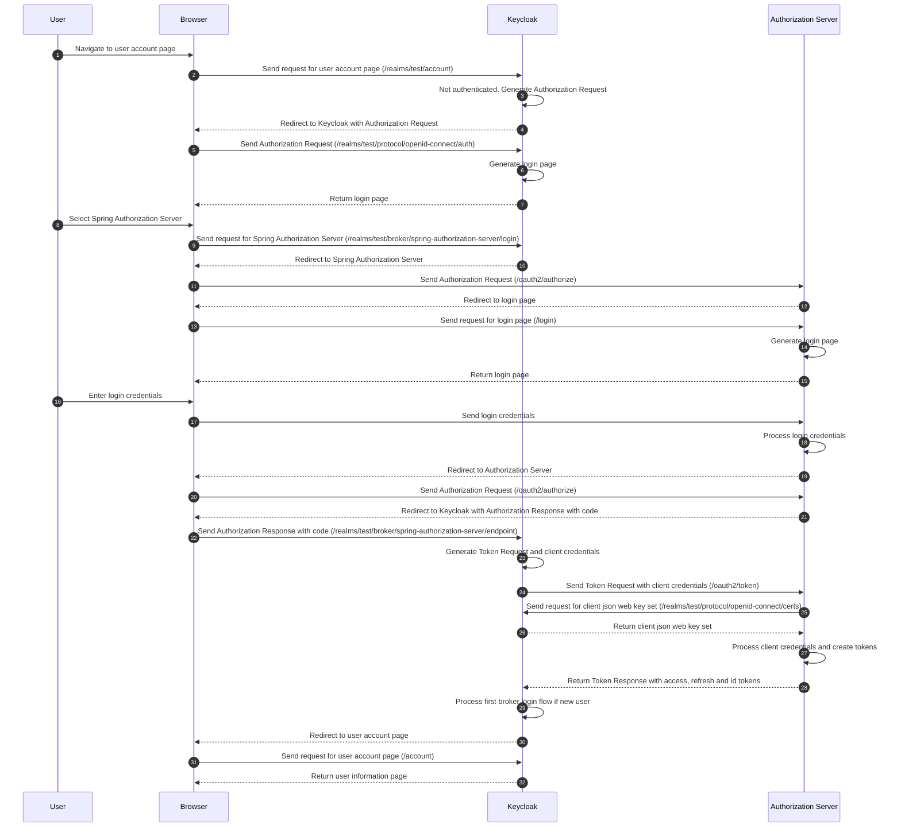

# Spring Boot Authorization Server Example

This project is an example implementation of a OAuth2 Authorization Server.

[Keycloak](https://github.com/keycloak/keycloak) is used as the Relying Party for testing purposes

## Quick Start

### Installing and running the Spring Boot Authorization Server application

```shell
mvn spring-boot:run
```

### Configuring Keycloak as the Relying Party to Broker to Spring Authorization Server

Start Keycloak

```shell
kc start-dev
```

Access Keycloak at http://localhost:8080/

* Create an administrative user
* Login to the administrative console
* Create the `test` realm
  * Click on the `Keycloak` dropdown on the left navigation bar
  * Select `Create Realm`
  * Set `test` as the `Realm name` and click on `Create`
* Create the `spring-authorization-server` Identity provider
  * Click on `Identity providers` on the left navigation bar
  * Click on `OpenID Connect v1.0`
  * Set `spring-authorization-server` as the `Alias`
  * Set `Spring Authorization Server` as the `Display name`
  * Set `http://localhost:9000/.well-known/openid-configuration` as the `Discovery endpoint`
  * Select `JWT signed with private key` as the `Client authentication`
  * Set `keycloak-client` as the `Client ID`
  * Click on `Add`
* Configure the Mappers for Spring Authorization Server
  * Click on `Mappers`
  * Add `email` mapper
    * Click on `Add mapper`
    * Set `email` as `Name`
    * Select `Attribute Importer` as `Mapper type`
    * Set `email` as `Claim`
    * Select `email` as `User Attribute Name`
  * Add `given_name` mapper
    * Click on `Add mapper`
    * Set `given_name` as `Name`
    * Select `Attribute Importer` as `Mapper type`
    * Set `given_name` as `Claim`
    * Select `firstName` as `User Attribute Name`
  * Add `family_name` mapper
    * Click on `Add mapper`
    * Set `family_name` as `Name`
    * Select `Attribute Importer` as `Mapper type`
    * Set `family_name` as `Claim`
    * Select `lastName` as `User Attribute Name`

### Testing the example Authorization Server

Access the Keycloak user account page at http://localhost:8080/realms/test/account/
* Click on `Spring Authorization Server` to login to the Spring Boot Authorization Server 
* Login using username `user1` and password `password`

View the public keys at http://localhost:9000/oauth2/jwks

View the OpenID Configuration at http://localhost:9000/.well-known/openid-configuration

## Integration Details

Note that this example does not securely store the private keys which are located in `src/main/resources/jwks.json`. This should be securely stored and rotated, for instance on AWS this should be stored in AWS Secrets Manager with a Secrets Manager Rotation Lambda. This can be configured in Spring using [Spring Cloud AWS Secrets Manager](https://github.com/awspring/spring-cloud-aws).

## Flow

